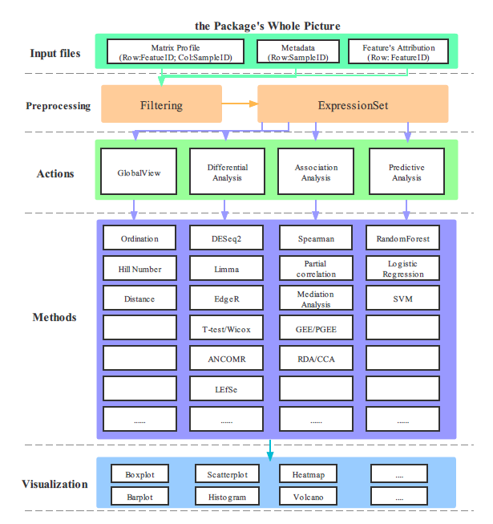

## MyRtools

**MyRtools** package is aimed at performing the common statistic approaches on omics data including metagenomics or transcriptomics data for me in a personal manner.  



### Introduction

After reviewing the **[microbiotaPair](https://github.com/rusher321/microbiotaPair)** package generated by my former tutor, building my own package for daily data analysis seems very necessary. Firstly, taking the schematic overview of microbiotaPair into account to reorganize the **MyRtools**. and then fulfilling all the missing modules in the methods part.

### Installation

```R
 if(!require(devtools)){
     install.packages("devtools")
 }
devtools::install_github("HuaZou/MyRtools")
library(MyRtools)
```


### Tutorial


### Comments and issues

Welcome any comments from all the world if you have any issues on this package. 


### Contributions

1. [Hua Zou](https://github.com/zouhua)

### Acknowledgement

Be Deeply grateful for the inspiration and scripts from **[microbiotaPair](https://github.com/rusher321/microbiotaPair)** and also thank you very much for the contributor named [Huahui Ren](https://github.com/rusher321).